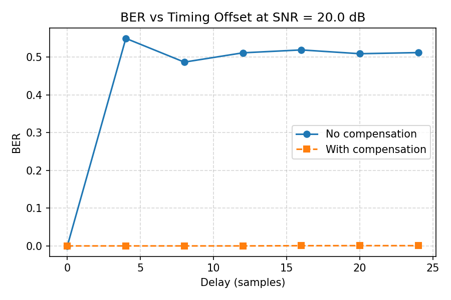
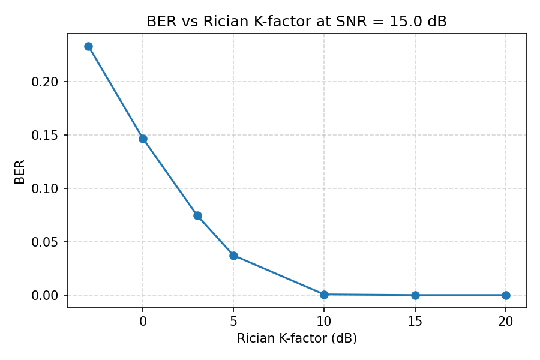

# ntn-linksim-leo

Simulation-first, reproducible OFDM link-level simulator for NTN/LEO research.

**Completed milestones:**
- **M0**: AWGN baseline with QPSK-OFDM, BER measurement, CLI, deterministic artifacts
- **M1**: CFO (Doppler) impairment + CP-based estimation + compensation
- **M2**: Delay / timing offset impairment + CP-based timing estimation + compensation
- **M3**: Rician fading channel + YAML scenario harness + `make reproduce`

## Quickstart

```bash
python3 -m venv .venv && source .venv/bin/activate
pip install -e ".[dev]"
pytest -q
```

## CLI Commands

**SNR sweep** (AWGN baseline):
```bash
ntnls simulate --snr-db 0 5 10 --seed 1 --out results/
```

**CFO sweep** (Doppler/compensation analysis):
```bash
ntnls cfo-sweep --cfo-hz 0 15000 30000 45000 60000 --snr-db 20 --seed 42 --out results_cfo/
```

**Delay sweep** (timing offset/compensation analysis):
```bash
ntnls delay-sweep --delay-samples 0 4 8 12 16 20 24 --snr-db 20 --seed 1 --out results_delay/
```

**Rician K-factor sweep**:
```bash
ntnls rician-sweep --k-db -3 0 3 5 10 15 20 --snr-db 15 --seed 1 --out results_rician/
```

**Run a single scenario**:
```bash
ntnls run-scenario scenarios/awgn.yaml --out results/
```

**Reproduce all figures**:
```bash
make reproduce        # Full scenarios -> docs/
make reproduce-mini   # Mini scenarios -> results_mini/ (fast, for CI)
```

## Artifacts

| Command | Outputs |
|---------|---------|
| `simulate` | `sweep.json`, `ber_vs_snr.png` |
| `cfo-sweep` | `sweep_cfo.json`, `ber_vs_cfo.png` |
| `delay-sweep` | `sweep_delay.json`, `ber_vs_delay.png` |
| `rician-sweep` | `sweep_rician.json`, `ber_vs_rician_k.png` |
| `run-scenario` | Depends on scenario sweep type |
| `reproduce` | All scenario artifacts in subdirectories |

## Example outputs

### BER vs SNR (AWGN baseline)


### BER vs CFO (Doppler compensation)


The CFO sweep demonstrates that without compensation, even moderate Doppler shifts
($\geq$ 15 kHz) push BER to ~0.5 (random guessing). CP-based CFO estimation and
compensation recover the signal, keeping BER usable up to 60 kHz CFO.

> **Note**: The CP-based estimator is fractional-only with unambiguous range $|CFO|\lt \frac{\Delta f}{2}$
> ($\pm$ 120 kHz for default parameters).

### BER vs Delay (Timing compensation)


The delay sweep shows that even delays within the CP length (16 samples) cause BER
degradation due to FFT window misalignment (per-subcarrier phase rotations). Delays
beyond the CP length produce severe ISI. CP-based timing estimation + compensation
realigns the FFT window, keeping BER near zero across all tested delays.

> **Note**: The timing estimator uses CP sliding correlation for integer-sample
> offset detection. Fractional delay injection is supported but compensation is
> integer-only.

### BER vs Rician K-factor


Single-tap block Rician fading (one i.i.d. coefficient per OFDM symbol, flat
fading). Lower K-factor means stronger NLOS scattering and higher BER. At very
high K (strong LoS), performance converges to the AWGN baseline.

> **Note**: No channel equalization is applied — BER degradation from fading is
> shown but not corrected. Single-tap only (no frequency selectivity).

## Scenarios

YAML-driven experiment configs in `scenarios/`. Each file specifies a base
`SimConfig` and a sweep type (`snr`, `cfo`, `delay`, `rician_k`):

| Scenario | Sweep | Channel |
|----------|-------|---------|
| `awgn.yaml` | SNR | Pure AWGN |
| `leo_fast.yaml` | SNR | CFO + delay + comp |
| `leo_fast_rician.yaml` | SNR | CFO + delay + Rician + comp |
| `cfo_sweep.yaml` | CFO | With compensation |
| `delay_sweep.yaml` | Delay | With compensation |
| `rician_k_sweep.yaml` | K-factor | Rician at fixed SNR |

`scenarios/mini/` contains smaller versions for CI.

## Known Limitations

- Rician fading is single-tap only (flat fading) — no frequency selectivity
- No channel equalization — BER degradation from fading is shown but not corrected
- Block fading (i.i.d. per symbol) — no temporal correlation / Doppler spectrum
