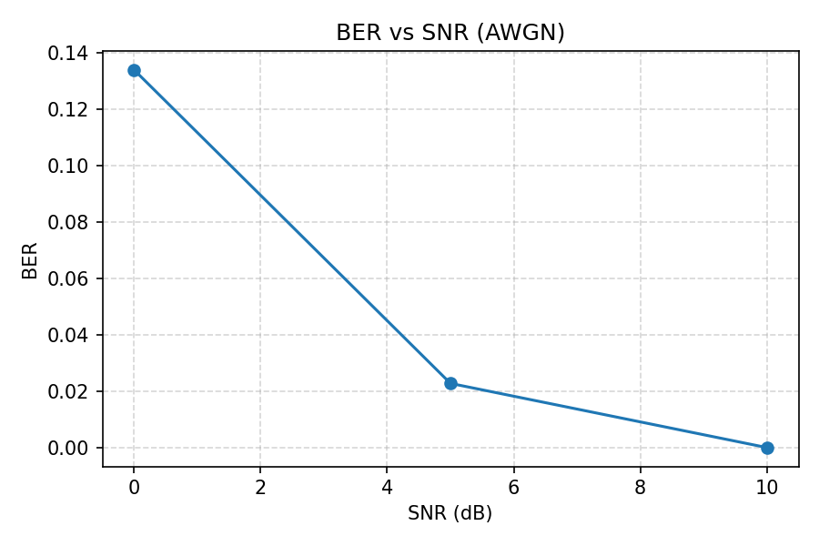
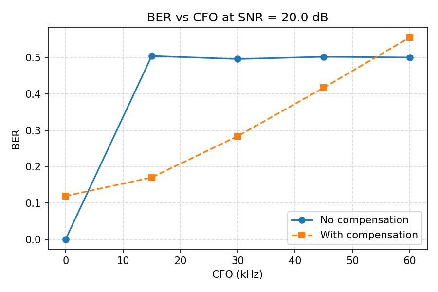

# ntn-linksim-leo

Simulation-first, reproducible OFDM link-level simulator for NTN/LEO research.

**Completed milestones:**
- **M0**: AWGN baseline with QPSK-OFDM, BER measurement, CLI, deterministic artifacts
- **M1**: CFO (Doppler) impairment + CP-based estimation + compensation

## Quickstart

```bash
python3 -m venv .venv && source .venv/bin/activate
pip install -e ".[dev]"
pytest -q
```

## CLI Commands

**SNR sweep** (AWGN baseline):
```bash
ntnls simulate --snr-db 0 5 10 --seed 1 --out results/
```

**CFO sweep** (Doppler/compensation analysis):
```bash
ntnls cfo-sweep --cfo-hz 0 15000 30000 45000 60000 --snr-db 20 --seed 42 --out results_cfo/
```

## Artifacts

| Command | Outputs |
|---------|---------|
| `simulate` | `sweep.json`, `ber_vs_snr.png` |
| `cfo-sweep` | `sweep_cfo.json`, `ber_vs_cfo.png` |

## Example outputs

### BER vs SNR (AWGN baseline)


### BER vs CFO (Doppler compensation)


The CFO sweep demonstrates that without compensation, even moderate Doppler shifts
($\geq$ 15 kHz) push BER to ~0.5 (random guessing). CP-based CFO estimation and
compensation recover the signal, keeping BER usable up to 60 kHz CFO.

> **Note**: The CP-based estimator is fractional-only with unambiguous range $|CFO|\lt \frac{\Delta f}{2}$
> ($\pm$ 120 kHz for default parameters).

## Next milestones

- **M2**: Delay + fractional delay (timing offset) with RX alignment
- **M3**: Rician fading + scenario harness
